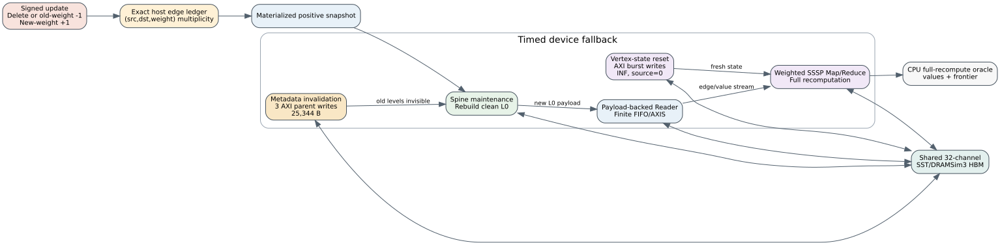

# Dynamic SSSP delete and weight-increase fallback

Date: 2026-07-25  
Branch: `codex/fine-grained-cycle-sim`  
Claim tier: `structural_execution_driven`  
Backend: Mock HBM and 32-channel SST memHierarchy + DRAMSim3

## Why a full fallback is required

Weighted SSSP insertion and weight decrease are monotonic: existing distances
can only improve, so Spine can preserve vertex state and relax from changed
sources. Edge deletion and weight increase are different. A previously chosen
shortest path can disappear and the correct distance must increase. The
minimum-based reducer cannot produce a larger value from the old state.

Spine's compacted level payload also retains the currently effective minimum
weight rather than enough history to reconstruct every superseded weight.
Therefore a signed update containing a deletion enters an explicit full
fallback:



1. a host-side exact `(src,dst,weight)` multiplicity ledger applies the signed
   delta and materializes the final positive graph snapshot;
2. the device invalidates every persisted level through timed AXI metadata
   writes, making stale graph payload unreachable without physically erasing
   the whole HBM allocation;
3. maintenance builds the materialized snapshot as a new L0;
4. Compute resets every vertex-state word through timed AXI writes (`INF`, with
   source 0 restored to zero);
5. Reader and Compute run normal weighted SSSP rounds to convergence.

Metadata invalidation and vertex-state reset use independent AXI bundles and
are allowed to overlap, matching the split-CU resource structure.

## Correctness cases

Initial graph:

```text
0 -> 1 (5)
0 -> 2 (100)
1 -> 2 (5)
2 -> 3 (1)
```

The cold result is `[0, 5, 10, 11]`.

### Pure deletion

The update removes `1 -> 2 (5)`. The final result must increase to
`[0, 5, 100, 101]`. The observed frontier sizes are
`[1,2,1] -> [2,1,0]` and all value/frontier mismatch counters are zero.

### Weight increase

The update is represented exactly as `-1 x (1 -> 2, weight 5)` followed by
`+1 x (1 -> 2, weight 50)`. The final result is `[0, 5, 55, 56]`. The observed
frontier sizes are `[1,2,2,1] -> [2,2,1,0]`, again with zero mismatches.

Both final results are checked against full CPU recomputation. The delete and
increase routing decision is independently checked from the signed update.

## SST evidence

Machine-readable evidence:

- `docs/evidence/sst_spine_dynamic_delete_20260725_summary.json`
- `docs/evidence/sst_spine_dynamic_increase_20260725_summary.json`

| metric | deletion | weight increase |
| --- | ---: | ---: |
| cold cycles | 25,649 | 25,649 |
| fallback update cycles | 22,520 | 28,751 |
| SSSP rounds after update | 3 | 4 |
| materialized edges | 3 | 4 |
| maintenance cycles | 5,326 | 5,439 |
| metadata clear cycles | 3,197 | 3,197 |
| metadata clear bytes | 25,344 | 25,344 |
| vertex reset cycles | 11 | 11 |
| vertex reset bytes | 16 | 16 |
| update maintenance scan visits | 60 | 80 |
| whole-process backend requests | 8,559 | 9,137 |
| DRAM activates | 316 | 332 |

For both cases, `DRAM reads + DRAM writes == backend requests`. The fixed
metadata-clear cost is identical. The weight-increase case takes longer due to
one additional materialized edge and one additional SSSP round, not because a
larger hidden reset constant was selected.

Mock-HBM structural evidence also passes:

```text
delete_cycles=21832
increase_cycles=27865
metadata_clear_bytes=25344
vertex_reset_bytes=16
```

## Reproduction

```bash
cd /home/chuxiao/spine-cycle-sim
cmake --build build/cycle-core -j2
./build/cycle-core/cpp/spine_cycle_core_tests \
  spine_nonmonotonic_full_rebuild

python3 scripts/run_sst_spine_vertical.py \
  --scenario dynamic_sssp_delete \
  --out-dir results/sst_spine_dynamic_delete_20260725

python3 scripts/run_sst_spine_vertical.py \
  --scenario dynamic_sssp_increase \
  --out-dir results/sst_spine_dynamic_increase_20260725
```

## Claim boundary

The reported fallback time is device kernel time: timed hierarchy
invalidation, graph rebuild, vertex reset, and SSSP execution. The host-side
exact edge-ledger update, snapshot materialization, and host-to-device transfer
are currently functional setup and are not timed. They must be reported
separately before making an application End2End claim. The current evidence is
appropriate for comparing device fallback mechanisms, not complete host
runtime.

The reset clears visibility metadata rather than all graph payload bytes. This
is deliberate: stale payload is unreachable after slice headers, epochs, and
page-list counts are invalidated, and the new writer publishes only its own
pages. Physically zeroing unused graph capacity would add traffic without
changing hardware-visible behavior.
