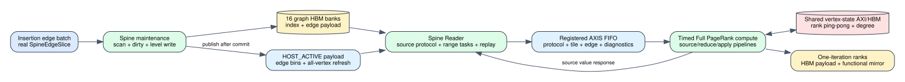

# Spine Full PageRank vertical slice

Date: 2026-07-25
Branch: `codex/fine-grained-cycle-sim`
Baseline commit: `47e4ea4`

## Scope

This milestone connects Full PageRank to the execution-driven Spine
maintenance and Reader path. The test no longer injects edge contributions
with a synthetic stream producer: maintenance writes the graph hierarchy to
HBM, Reader performs metadata/range construction and edge replay, and the
timed PageRank compute consumes the resulting AXIS stream.



The source protocol refreshes all vertices, while host active bins contain
only edge-bearing sources. Cold destination-partition masks and hot shard masks
are derived from the workload and configured hot bitmap. Edgeless sources are
therefore included in dangling reduction without creating fake edge probes.

## Execution order

1. `SpineL0Maintenance` scans the real edge batch, updates persistent dirty
   state, selects the target level, and writes level index/edge payloads.
2. Once maintenance commits, Reader publishes the initial HOST_ACTIVE payload.
   This ordering is necessary because maintenance intentionally clears stale
   host-coverage metadata at the start of an update.
3. Reader requests rank-derived contributions for all vertices through the
   bounded source request/value streams.
4. Reader reads level metadata and edge payloads through the existing graph
   AXI ports, constructs destination-tile ranges, and replays contributions.
5. PageRank compute performs finite reductions and all-vertex apply while
   issuing rank/degree reads and ping-pong writes through the shared
   vertex-state AXI/HBM channel.
6. FIFO occupancy and backpressure arise from the connected producer and
   consumer; neither side calls the other directly.

The initial vertical slice currently accepts insertion-only graphs. This is a
deliberate validation boundary: dynamic deletion requires an existing graph
state plus PageRank warm-start/update semantics and is not silently interpreted
as an initial graph.

## Deterministic evidence

For the same four-vertex fixture used by the compute-only test:

```text
end-to-end cycles:             7,810
maintenance cycles:           2,414
source requests/responses:    4 / 4
source request windows:       1
Reader edges emitted:         4
Reader edge payload bytes:    64
compute state HBM requests:   16
AXIS words pushed:            24
new rank:                     [0.1, 0.2, 0.6, 0.1]
rank sum:                     1.0
```

The 64 edge-payload bytes are expected. Each 8-byte level edge is read once
during exact range construction and once during ordered replay. Reporting only
32 bytes would hide half of the current Reader traffic.

The 24 AXIS words include four source requests, three source protocol markers,
one tile begin, four edges, one tile end, ten diagnostics, and one done word.
This proves the result traversed the complete Reader protocol rather than a
direct contribution callback.

Machine-readable evidence is
`docs/evidence/spine_full_pagerank_vertical_slice_20260725.json`.

## Reproduction

```bash
cd /home/chuxiao/spine-cycle-sim
cmake --build build/cycle-core -j2
./build/cycle-core/cpp/spine_cycle_core_tests spine_pagerank_vertical_slice
./build/cycle-core/cpp/spine_cycle_core_tests
python3 -m unittest discover -s tests
make -C cpp/sst -B -j2
git diff --check
```

## Claim boundary

This proves a correct, timed, one-iteration Full PageRank vertical slice on
Mock HBM. It is not yet a calibrated PageRank performance result.

Remaining work inside this path:

1. add iteration reset and physical rank-buffer swap;
2. converge on real graph files and compare every rank against an independent
   CPU oracle;
3. execute the same connected system with SST-HBM;
4. characterize floating-point and tile-accumulator pipeline latency/II;
5. support warm-start updates/deletions and thresholded residual PageRank.
