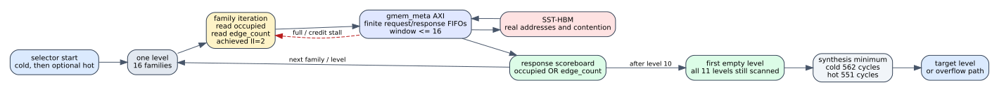

# Spine HBM-driven target selector

Date: 2026-07-24
Branch: `codex/fine-grained-cycle-sim`

## Closed gap

The maintenance model previously enqueued one placeholder bulk metadata read,
then selected the first empty level from the C++ `SpineL0State` mirror. The HLS
does neither operation: for every one of 11 levels it scans all 16 families and
reads two independent 64-bit words, `occupied` and `edge_count`, from
`gmem_meta`. It treats either nonzero word as occupied and scans all levels even
after finding the first empty one. Hot mode invokes a second independent scan
over the 16 hot families.

The simulator now executes that source-visible protocol. Each level emits 32
ordered parent reads, waits for their HBM payloads, validates a two-bit response
scoreboard for every family, and only then advances to the next level. Target
selection uses only returned payloads. The general compatibility window remains
one request per AXI initiator; this synthesis-backed loop has its own maximum
window of 16.



## Synthesis constraint

The accepted 2026-07-11 Vitis HLS report records:

| block | latency / loop result |
| --- | ---: |
| `PARTITIONED_LEVEL_OCCUPIED_SCAN` | iteration latency 16, achieved II=2, trip count 16 |
| cold `partitioned_select_binary_target` | 562 cycles |
| hot `partitioned_select_binary_target_for_family_range` | 551 cycles |

The current source at `afb8199a2ca8d3fd208b985324bf4d8719e2b839`
retains the same loop, two metadata reads, and `PIPELINE II=1` directive. The
reports predate that commit, so they are labeled accepted synthesis evidence,
not a fresh synthesis of the exact commit. The simulator uses 562/551 as a
no-stall minimum; slower HBM responses extend execution rather than being
hidden by the floor.

Report paths:

```text
/data/feiyang/spine-dynamic-graph/tests/test_integration/
  csynth_readmaint_prj/sol/syn/report/
    partitioned_level_occupied_in_family_range_csynth.rpt
    partitioned_select_binary_target_csynth.rpt
    partitioned_select_binary_target_for_family_range_csynth.rpt
```

## Anti-bypass evidence

The dedicated C++ test initializes logical L0 with one edge, then clears both
L0 `edge_count` and `occupied` in HBM after construction. The result is
`target=0` and the old logical L0 edge is replaced. The former implementation
would have observed the logical vector and selected `target=1`.

The exact cold ledger is 11 levels, 176 family iterations, 352 responses, and
2,816 payload bytes. It reaches the 562-cycle synthesis floor with zero
validation failures.

## SST-HBM impact

| scenario | cycles before / after | delta | selectors | backend requests | result |
| --- | ---: | ---: | ---: | ---: | --- |
| Amazon L0 | 7,151 / 7,303 | +2.13% | 1 | 1,399 | zero mismatch |
| carry + hot | 8,863 / 9,280 | +4.70% | 2 | 1,944 | zero mismatch |
| weighted SSSP | 33,788 / 34,087 | +0.88% | 1 | 4,196 | zero mismatch |

Backend beat counts remain unchanged. The old bulk request contained the same
number of 8-byte metadata beats, but it erased request boundaries, per-level
dependencies, and the cold-to-hot control dependency. Exact addresses and
ordering also change DRAM row behavior: activation counts become 78, 110, and
240 respectively. This is direct evidence that byte-count-only memory models
cannot recover the timing of this block.

Machine-readable evidence is in
`docs/evidence/spine_hbm_target_selector_20260724.json`.

## Reproduction

```bash
cd /home/chuxiao/spine-cycle-sim
cmake --build build/cycle-core -j2
ctest --test-dir build/cycle-core --output-on-failure
python3 -m unittest discover -s tests
make -C cpp/sst -j2

./build/cycle-core/cpp/spine_cycle_core_tests \
  spine_target_hbm_metadata_payload
python3 scripts/run_sst_spine_vertical.py \
  --scenario amazon_l0 --no-build \
  --out-dir results/sst_spine_target_selector_amazon_20260724
python3 scripts/run_sst_spine_vertical.py \
  --scenario carry_hot --no-build \
  --out-dir results/sst_spine_target_selector_carry_hot_20260724
python3 scripts/run_sst_spine_vertical.py \
  --scenario weighted_sssp --no-build \
  --out-dir results/sst_spine_target_selector_weighted_20260724
```

## Remaining boundary

The target branch is now HBM-payload-driven. Hot/cold classification was the
next protocol gap and is closed by `spine_hbm_hot_bitmap_20260724.md`. The
current overflow path still stops the component instead of writing the complete
HLS result transcript; that remains a separate protocol gap.
