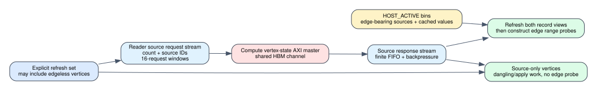

# HOST_ACTIVE algorithm source refresh

Date: 2026-07-25
Branch: `codex/fine-grained-cycle-sim`
Baseline commit: `d190643`

## Scope

This milestone extends the Spine HOST_ACTIVE reader protocol so the set of
vertex states refreshed from HBM can differ from the edge-bearing active
records supplied by the host.



The distinction is required by Full PageRank. A vertex with no outgoing edges
has no active edge record, but its rank and degree still participate in the
dangling-mass reduction and its next rank must still be applied. Treating the
host record's cached source value as authoritative would both skip such
vertices and allow stale state to enter edge-map.

## Protocol behavior

`reset_host_round()` now accepts an optional explicit source-refresh list.
The list is checked for duplicates and graph bounds. When non-empty, Reader:

1. sends the explicit count and source IDs over the existing reader-to-compute
   source protocol;
2. observes the existing 16-request source window and finite AXIS FIFOs;
3. receives source values through the existing compute-to-reader response
   stream after the compute side reads vertex state from HBM;
4. overwrites stale source values in both the flat active-record view and the
   partitioned active-bin view before constructing range probes; and
5. retains source-only vertices in the round frontier even when they emit no
   edges.

This is not free metadata. A Full PageRank profile that refreshes all `N`
vertices pays `N` source requests, `N` state responses, the corresponding HBM
traffic, and any FIFO/backpressure stalls. It reuses the existing vertex-state
AXI master and does not add an HBM channel.

## Regression evidence

The directed fixture has four vertices and one edge `0 -> 1`. The system is
seeded from vertex 2, so vertex 0 remains at infinity. The host then supplies a
deliberately stale active record for vertex 0 with value zero and asks Reader
to refresh vertices `{0, 2}`. Vertex 2 has no outgoing edge.

```text
source requests/responses: 2 / 2
source request windows:     1
compute source count:       2
reader source IDs:          0, 2
edges emitted/processed:    1 / 1
destination 1 value:        infinity
next active vertices:       0
```

The final infinity proves that the edge carried the refreshed HBM value, not
the stale host payload. The source count and IDs prove that the edgeless vertex
was not dropped.

Machine-readable evidence is
`docs/evidence/spine_host_algorithm_source_refresh_20260725.json`.

## HLS relationship

The target `reduce-levels-for-routing` HLS design already has source-state
request/response streams for the DEVICE_DIRTY SSSP path. This simulator change
reuses that protocol for HOST_ACTIVE algorithm rounds. It is an explicit
algorithm-support extension, not a claim that the current HLS kernel already
implements Full PageRank. A later HLS reference implementation must expose the
same all-source protocol and account for its stream and memory cost.

## Reproduction

```bash
cd /home/chuxiao/spine-cycle-sim
cmake --build build/cycle-core -j2
./build/cycle-core/cpp/spine_cycle_core_tests spine_host_source_refresh
./build/cycle-core/cpp/spine_cycle_core_tests
python3 -m unittest discover -s tests
make -C cpp/sst -B -j2
git diff --check
```

## Remaining boundary

1. Full PageRank and thresholded residual PageRank are not yet wired through a
   timed Spine compute controller.
2. The explicit refresh currently transports the primary source value. Degree,
   residual, dangling reduction, ping-pong rank state, and all-vertex apply
   still need timed HBM transactions.
3. HOST_ACTIVE fallback must be tested with all-source PageRank traffic once
   the PageRank controller exists.
4. The corresponding HLS protocol extension and synthesis evidence remain
   future deliverables.
