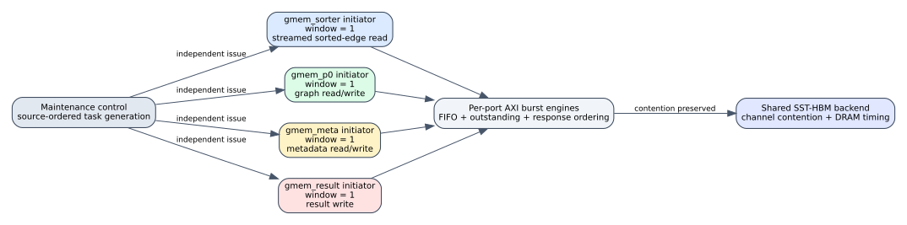

# Spine independent AXI bundle scheduling

Date: 2026-07-24  
Branch: `codex/fine-grained-cycle-sim`

## Closed gap

The maintenance and reader task scoreboards previously applied
`memory_request_window` to the aggregate number of in-flight logical requests.
That serialized a long streamed `sorted_edges` request against graph, metadata,
and result traffic. The target HLS source declares these pointers on distinct
`m_axi` bundles (`gmem_sorter`, `gmem_p0..15`, `gmem_meta`, and
`gmem_result`), so the aggregate gate was structurally incorrect.

The window is now counted per `FixedAxiPort`/initiator. The default value one
allows different bundles to overlap but permits only one logical parent
request per bundle. Each AXI master still independently enforces its request
FIFO, burst splitting, outstanding-burst limit, ordered parent response, and
backend backpressure. All ports still contend in the same SST-HBM backend, so
the change does not skip DRAM contention.

Values above one remain a same-port architecture what-if. They do not claim
that an unpipelined HLS loop can issue arbitrary parent requests concurrently.
The dedicated reader edge pipeline remains a separate, source-backed exception
with its own request and response credits.



## Acceptance evidence

The C++ memory-window microbenchmark preserves values, frontier, traffic bytes,
and backend request count. With the default window it observes exactly one
logical request per port, two simultaneously active ports, and 53 cycles of
cross-port overlap. A window of 32 reaches 32 same-port requests and remains an
explicit what-if.

Three online SST-HBM scenarios preserve request count and finish with zero
value/frontier mismatches:

| scenario | old cycles | per-port cycles | max ports | overlap cycles |
| --- | ---: | ---: | ---: | ---: |
| Amazon L0 | 7,187 | 7,157 | 2 | 34 |
| carry hot | 8,966 | 8,884 | 3 | 89 |
| weighted SSSP | 33,866 | 33,788 | 2 | 33 |

The small speedups are the expected result: only the false scheduler
serialization changed. No memory operation was deleted, and the shared HBM
timing can still change slightly because requests now reach it in a more
source-faithful order.

Machine-readable evidence is in
`docs/evidence/spine_independent_axi_bundles_20260724.json`.

## Reproduction

```bash
cd /home/chuxiao/spine-cycle-sim
cmake --build build/cycle-core -j2
ctest --test-dir build/cycle-core --output-on-failure
python3 -m unittest discover -s tests
make -C cpp/sst -j2

python3 scripts/run_sst_spine_vertical.py \
  --scenario amazon_l0 --no-build \
  --out-dir results/sst_spine_per_port_window_amazon_20260724
python3 scripts/run_sst_spine_vertical.py \
  --scenario carry_hot --no-build \
  --out-dir results/sst_spine_per_port_window_carry_hot_20260724
python3 scripts/run_sst_spine_vertical.py \
  --scenario weighted_sssp --no-build \
  --out-dir results/sst_spine_per_port_window_weighted_20260724
```

## Remaining boundary

The component still accepts at most one queued logical task globally per core
cycle and retires at most one parent response per core cycle. This milestone
closes false long-lived blocking across ports; it does not yet claim a complete
multi-port same-cycle HLS schedule. The next L0 online writer milestone will
exercise the independent sorted/graph bundles at edge granularity.
