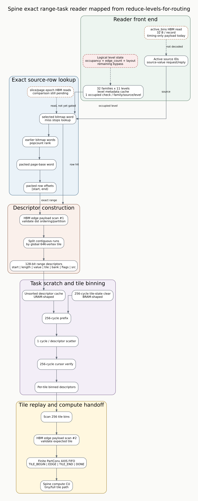

# Spine metadata and active-frontier payload authority

Status: historical payload-authority milestone. HOST tiled fallback and DEVICE
handoff were subsequently completed in
`docs/spine_host_tiled_fallback_20260724.md`; its claim boundary supersedes the
fallback limitations below.

Date: 2026-07-24
Branch: `codex/fine-grained-cycle-sim`
HLS reference: `origin/reduce-levels-for-routing` at
`afb8199a2ca8d3fd208b985324bf4d8719e2b839`

## Scope

This milestone closes the two correctness-critical bypasses left by the exact
range-task reader milestone. The reader no longer obtains level layout or the
active-source set from `SpineL0State`. Its control decisions now consume the
same HBM payload classes used by the referenced HLS design:

- 32 families x 11 levels, with eight 64-bit metadata words per slice;
- format magic, version, feature bits, and hot-enabled control;
- edge count, row count, graph offsets, occupied bit, and slice epoch;
- page epoch, checked against the slice epoch before any graph-index read;
- DEVICE_DIRTY count, generation, sum hash, XOR hash, list, and bitmap;
- HOST_ACTIVE bin offsets/counts and 256-bit active records;
- active-record source, source value, 11 destination-partition masks, and
  16-bit hot-shard mask.

The reader constructor no longer accepts `SpineL0State`. This makes a logical
level-state bypass impossible at the C++ interface rather than merely unused by
convention.



## Execution flow

Maintenance materializes the HLS-shaped data first. It writes graph index and
edge payloads, slice metadata, slice/page epochs, and the persistent dirty
frontier to the payload-backed memory backend.

The first compute round uses DEVICE_DIRTY:

1. validate the metadata control word;
2. read dirty count/generation/hash metadata;
3. fetch the persistent list and bitmap from the shared HBM16 scratch port;
4. validate list range, list/bitmap agreement, and both hashes;
5. request source values through the reader-compute AXIS protocol;
6. decode level metadata and epochs, construct exact range tasks, and replay
   HBM graph payloads into the finite PartConv stream.

Later SSSP rounds use HOST_ACTIVE. The host-reference step creates the same
32-byte records as the HLS host path and writes per-partition offset/count
metadata. The reader fetches and decodes those records from HBM. Source value
requests are therefore present only in the DEVICE_DIRTY round.

Host construction and transfer of HOST_ACTIVE records are currently outside
the timed kernel window. Their HBM reads are timed; host preparation is not.

## Anti-bypass evidence

The `spine_reader_hbm_graph_payload` C++ test mutates only memory payloads while
leaving the logical graph state unchanged:

| payload mutation | required observed behavior |
| --- | --- |
| dirty list source differs from `reset_round()` argument | reader follows the list payload |
| occupied metadata is cleared | no level or edge is emitted |
| page epoch differs from slice epoch | graph-index request is gated and epoch miss increments |
| edge-offset metadata is shifted | returned edge/proposal changes |
| format magic is cleared | reader reports a metadata format error |
| graph bitmap/page base/row offset/edge bytes are changed | source-row lookup and emitted edge follow HBM |

The weighted SSSP test additionally checks the mode transition. Reader source
counts are `[5,2,2,2,1,0]`; source-value AXIS requests are `[5,0,0,0,0,0]`;
dirty-list traffic appears only in round 0; active-bin traffic appears only in
later nonempty rounds.

## SST-DRAMSim3 evidence

All scenarios pass graph/frontier correctness. Backend accepted requests equal
completed DRAM reads plus writes in every run.

| scenario | cycles | DRAM requests | metadata | dirty list / bitmap | active-bin reads |
| --- | ---: | ---: | ---: | ---: | ---: |
| Amazon L0 exact | 5,829 | 581 | 2,928 B | 16 / 16 B | 0 B |
| carry + hot/cold | 6,277 | 649 | 3,000 B | 16 / 16 B | 0 B |
| weighted SSSP, 6 rounds | 30,660 | 2,636 | `[2960,3160,3160,3160,3152,3144]` B | `[80,0,0,0,0,0]` B each | `[0,64,64,64,32,0]` B |

The weighted first round now processes all eight update edges from five dirty
sources. The logical SSSP frontier still begins at one source and remains
`[1,3,2,2,2,1]`; the two counts represent different interfaces and are both
checked. Final values are `[0,3,2,7,8,10]` after six rounds.

Frozen evidence:

- `docs/evidence/sst_spine_metadata_payload_amazon_l0_20260724_summary.json`
- `docs/evidence/sst_spine_metadata_payload_carry_hot_20260724_summary.json`
- `docs/evidence/sst_spine_metadata_payload_weighted_sssp_20260724_summary.json`

## Reproduction

```bash
cd /home/chuxiao/spine-cycle-sim

cmake --build build/cycle-core -j2
ctest --test-dir build/cycle-core --output-on-failure
python3 -m unittest discover -s tests

make -C cpp/sst -j2
python3 scripts/run_sst_spine_vertical.py \
  --scenario amazon_l0 \
  --out-dir results/sst_spine_metadata_payload_amazon_20260724 \
  --no-build
python3 scripts/run_sst_spine_vertical.py \
  --scenario carry_hot \
  --out-dir results/sst_spine_metadata_payload_carry_20260724 \
  --no-build
python3 scripts/run_sst_spine_vertical.py \
  --scenario weighted_sssp \
  --out-dir results/sst_spine_metadata_payload_weighted_20260724 \
  --no-build
```

## Claim boundary and remaining gaps

This milestone supports the claim that reader source selection, level layout,
epoch gating, exact row discovery, and edge replay are execution-driven by HBM
payloads. It does not establish full HLS-cycle equivalence.

1. Maintenance target/carry selection still uses its logical state while graph
   edge carry payload is memory-backed. The page-list control path is not yet
   payload-authoritative.
2. DEVICE_DIRTY still serializes source-value request/reply. The HLS protocol's
   finite request window, generation markers, coverage acknowledgement, and
   diagnostic stream are not modeled end to end.
3. Exact-reader fallback is detected and classified but the host touched-tile
   fallback path is not executed.
4. Component memory requests are mostly serialized. HLS loop-level outstanding
   windows, burst coalescing, response FIFOs, and overlap need explicit issue
   state machines even though the shared AXI/HBM backend already models finite
   queues and contention.
5. Descriptor/active/level URAM and tile BRAM accesses have explicit logical
   work but not bank/port conflict timing.
6. Clock conversion, CDC, kernel launch, host transfer, and dirty-ACK accounting
   remain configurable or excluded rather than calibrated protocol paths.

The next implementation milestone should close fallback and dirty protocol
semantics, then add pipelined request issue/backpressure. Those changes are
required before making absolute cycle or cross-architecture speedup claims.

Status update: the bounded source-value request/response protocol and its ACK
are closed in `docs/spine_source_value_protocol_20260724.md`. Dirty ownership
ACK, diagnostics, and fallback remain open.
