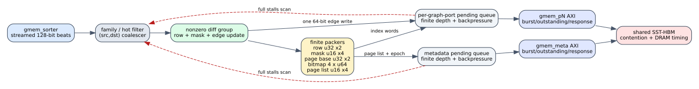

# Spine online L0 writer

Date: 2026-07-24
Branch: `codex/fine-grained-cycle-sim`

## Closed gap

The old L0 path consumed an entire sorted-edge scan, built Python vectors, and
then enqueued bulk index and edge payloads. That preserved bytes but erased the
causal overlap and backpressure of the HLS `PARTITIONED_WRITE_L0_EDGES` loop.

The maintenance component now uses one shared level-writer implementation for
both L0 and carry targets. During the streamed L0 scan it:

1. filters the returned HBM edge by cold partition or hot shard;
2. coalesces adjacent `(src,dst)` records and drops zero differential groups;
3. emits one 64-bit edge write per surviving group;
4. incrementally packs row offsets, row masks, page bases, four-word page
   bitmaps, page lists, and page epochs;
5. flushes only pending packer words after the scan;
6. validates emitted rows/edges against the preceding HLS-shaped precount.

The logical output vector is reconstructed from returned HBM payloads. It is
no longer the source of L0 writes. The sorted-payload anti-bypass test mutates
HBM after construction and verifies that both persisted graph payload and
logical state follow the mutated edge.



## Finite backpressure

Writer operations wait in per-port producer queues bounded by the corresponding
AXI request FIFO depth. Before consuming another sorted edge, the scanner
reserves worst-case graph and metadata headroom for one group/final flush. A
full queue therefore stalls the scan instead of allowing an unbounded C++
deque to absorb work.

The 256-row `II=1` stress case emits all 256 groups and exact packer counts,
while recording 12,468 backpressure cycles. The maximum pending count on one
port is 26 against depth 32. This is deliberately orthogonal to the default
`II=24` synthesis-backed profile, where the writer usually drains between
input iterations.

## HLS mapping

The source reference is `origin/reduce-levels-for-routing` at
`afb8199a2ca8d3fd208b985324bf4d8719e2b839`:

- `partitioned_count_l0_coalesced_rows_family` supplies exact rows/edges;
- `partitioned_write_l0_family` scans `sorted_edges` with a pipelined loop;
- `partitioned_emit_l0_group` performs edge, row, mask, bitmap, page-list, and
  epoch side effects;
- pending u32/u16/bitmap helpers combine partial 64-bit graph words.

The simulator keeps the measured/profiled write-scan II configurable. Source
`II=1` is a directive; the default `II=24` remains the accepted synthesis
timing evidence until the latest HLS revision is synthesized.

## SST-HBM evidence

All three scenarios preserve exact graph/index bytes, backend beat count, and
dual-oracle correctness:

| scenario | cycles | logical requests old/new | backend requests | overlap/wait cycles |
| --- | ---: | ---: | ---: | ---: |
| Amazon L0 | 7,151 | 105 / 114 | 1,399 | 64 / 45 |
| carry hot | 8,863 | 214 / 214 | 1,944 | 0 / 46 |
| weighted SSSP | 33,788 | 119 / 129 | 4,196 | 57 / 59 |

Logical parent requests increase when an old bulk edge payload becomes one
parent write per HLS edge assignment. Backend requests do not increase because
the 64-bit graph AXI already produced one backend beat per edge. Carry-hot has
zero L0 overlap because its single hot group is emitted only at final flush;
that is the causal result, not a missing counter.

Machine-readable evidence is in
`docs/evidence/spine_online_l0_writer_20260724.json`.

## Reproduction

```bash
cd /home/chuxiao/spine-cycle-sim
cmake --build build/cycle-core -j2
ctest --test-dir build/cycle-core --output-on-failure
python3 -m unittest discover -s tests
make -C cpp/sst -j2

python3 scripts/run_sst_spine_vertical.py \
  --scenario amazon_l0 --no-build \
  --out-dir results/sst_spine_online_l0_writer_amazon_20260724
python3 scripts/run_sst_spine_vertical.py \
  --scenario carry_hot --no-build \
  --out-dir results/sst_spine_online_l0_writer_carry_hot_20260724
python3 scripts/run_sst_spine_vertical.py \
  --scenario weighted_sssp --no-build \
  --out-dir results/sst_spine_online_l0_writer_weighted_20260724
```

## Remaining boundary

The writer models source-visible memory operations and finite queue pressure,
but it does not reconstruct the exact RTL schedule of every inlined pointer
assignment within one HLS iteration. It stages at most one logical task from
the maintenance scheduler per core cycle and retires at most one parent
response per cycle. Same-cycle multi-port issue/retire remains a finer-grained
gap; current overlap is conservative.
