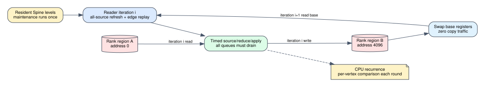

# Spine Full PageRank multi-round execution

Date: 2026-07-25
Branch: `codex/fine-grained-cycle-sim`
Baseline commit: `6b87386`

## Scope

This milestone makes the connected Spine Full PageRank vertical slice reusable
across iterations. Maintenance and the graph hierarchy remain resident. Each
new iteration resets Reader and compute protocol state, exchanges the physical
rank-buffer bases, and reruns all source, edge, reduce, apply, AXI, FIFO, and
HBM behavior.



There is no hidden rank-array copy. If iteration `i` writes region B, iteration
`i+1` reads region B and writes region A. Both regions remain behind the same
vertex-state AXI master and HBM pseudo-channel.

## Reset contract

An iteration can restart only when:

- maintenance, Reader, and compute have completed successfully;
- all external AXI ports and AXIS FIFOs are empty;
- all source/reduce/apply pipeline requests, responses, and in-flight
  operations are drained; and
- no destination scoreboard, apply transaction, or memory request remains.

The reset clears per-round counters and protocol state, but preserves graph
levels, current ranks, degree state, and monotonic transaction identity.
Arithmetic pipeline counters and FIFO statistics are also reset only after a
drain.

## Evidence

The four-vertex analytical fixture produces:

```text
iteration 1 rank: [0.10, 0.20, 0.60, 0.10]
iteration 2 rank: [0.17, 0.21, 0.45, 0.17]
iteration 2 dangling mass/share: 0.60 / 0.12
```

The first output base is `4096`. At the second iteration it becomes the read
base, while address `0` becomes the write base. Maintenance ends at cycle
`2414` and never advances again.

A 25-iteration run compares every vertex after every iteration against an
independent CPU PageRank recurrence:

```text
total cycles:                    137,314
first iteration incl. maint:       7,810
each later Reader+compute round:    5,396
maximum vertex oracle error:      8.9407e-08
final simulated L1 error:         0
maintenance reruns:               0
```

The exact zero final error is a float32 fixed point for this fixture, not a
general convergence guarantee. The meaningful correctness bound is the
maximum per-vertex oracle error across all 25 iterations.

Machine-readable evidence is
`docs/evidence/spine_pagerank_multiround_20260725.json`.

## Reproduction

```bash
cd /home/chuxiao/spine-cycle-sim
cmake --build build/cycle-core -j2
./build/cycle-core/cpp/spine_cycle_core_tests spine_pagerank_vertical_slice
./build/cycle-core/cpp/spine_cycle_core_tests
python3 -m unittest discover -s tests
make -C cpp/sst -B -j2
git diff --check
```

## Remaining boundary

The mechanism is now sufficient for Full PageRank convergence. The next
correctness milestone must load real graph files, compare against an
independent CPU implementation over multiple graph structures, and define a
stopping criterion that is consistent between simulator and reference.

Performance remains provisional until floating-point pipeline and tile
accumulator timing are characterized and the connected multi-round system runs
against SST-HBM.
