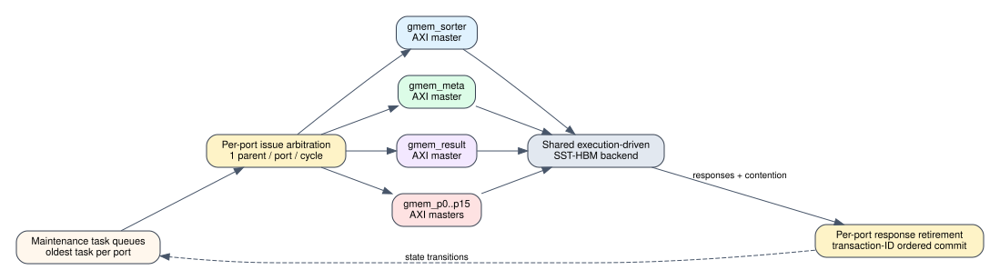

# Spine same-cycle AXI bundle arbitration

Date: 2026-07-24
Branch: `codex/fine-grained-cycle-sim`

## Closed gap

The maintenance scoreboard already represented `gmem_sorter`, `gmem_meta`,
`gmem_result`, and graph ports as independent `FixedAxiPort` instances. It
still issued only `tasks_.front()` and retired only the globally oldest parent
response in each core cycle. That final global gate serialized otherwise
independent HLS `m_axi` bundles.

The scheduler now:

1. considers the oldest queued task for every distinct AXI port;
2. issues at most one parent request per port per core cycle;
3. preserves same-port queue order and overlapping read/write hazards;
4. retires at most one parent response from every distinct port per cycle;
5. commits same-cycle responses in deterministic transaction-ID order; and
6. leaves burst splitting, beat issue, finite FIFOs, outstanding limits,
   response ordering, and shared SST-HBM contention unchanged.



## HLS mapping

    repository: /home/chuxiao/spine-dynamic-graph-reduce-levels
    revision:   origin/reduce-levels-for-routing
    commit:     afb8199a2ca8d3fd208b985324bf4d8719e2b839
    file:       src/spine_partitioned.hpp
    sha256:     d5c4a2f2c2f384e33808eee4250c0c88208027b3792d46425e1de2ae1d8a06ba

The accepted maintenance entry point declares 16 graph bundles
`gmem_p0..gmem_p15`, plus independent `gmem_sorter`, `gmem_meta`, and
`gmem_result` bundles. The source-facing AXI profile still limits each modeled
master to one address acceptance, one beat issue, and one response beat per
cycle. This change exposes concurrency across bundles; it does not invent
multi-parent issue bandwidth inside one bundle.

## Anti-serialization evidence

The `spine_memory_request_window` C++ microbenchmark uses the default
single-parent window. It observes:

| metric | value |
| --- | ---: |
| maximum maintenance parent issues in one cycle | 2 |
| maximum maintenance parent responses retired in one cycle | 2 |
| cycles with multi-port parent issue | 2 |
| cycles with multi-port parent retirement | 2 |
| maximum simultaneously active maintenance ports | 2 |

The same test verifies unchanged values, frontier, task count, graph bytes,
metadata bytes, backend request count, and issue/retire balance. The existing
AXI profile test independently verifies the one-address/one-beat/one-response
per-cycle limit on every individual port.

## SST-HBM impact

The before column is the epoch-lifecycle milestone (`9823971`).

| scenario | cycles before / after | maintenance before / after | requests | max issue / retire | multi issue / retire cycles | correctness |
| --- | ---: | ---: | ---: | ---: | ---: | ---: |
| Amazon L0 | 7,305 / 7,305 | 2,446 / 2,446 | 1,400 / 1,400 | 2 / 2 | 2 / 2 | 0 mismatches |
| carry + hot | 9,714 / 9,702 | 4,766 / 4,759 | 2,016 / 2,016 | 3 / 2 | 6 / 4 | 0 mismatches |
| weighted SSSP | 34,087 / 34,087 | 2,506 / 2,506 | 4,197 / 4,197 | 2 / 2 | 2 / 2 | 0 mismatches |

Only the carry-heavy case exposes 12 E2E cycles. This is consistent with a
small scheduler artifact: no request disappeared, and two scenarios hide or
do not exercise the corrected overlap. Carry HBM commands change from 130 to
129 ACTs because the newly legal arrival order changes one row-buffer outcome;
that contention remains execution-driven in SST-HBM.

Complete summaries and the selected comparison are in
`docs/evidence/sst_spine_same_cycle_axi_*_20260724_summary.json` and
`docs/evidence/spine_same_cycle_axi_arbitration_20260724.json`.

## Reproduction

```bash
cd /home/chuxiao/spine-cycle-sim
cmake --build build/cycle-core -j2
./build/cycle-core/cpp/spine_cycle_core_tests spine_memory_request_window
ctest --test-dir build/cycle-core --output-on-failure
python3 -m unittest discover -s tests
make -C cpp/sst -j2

python3 scripts/run_sst_spine_vertical.py \
  --scenario amazon_l0 --no-build \
  --out-dir results/sst_spine_same_cycle_axi_amazon_l0_20260724
python3 scripts/run_sst_spine_vertical.py \
  --scenario carry_hot --no-build \
  --out-dir results/sst_spine_same_cycle_axi_carry_hot_20260724
python3 scripts/run_sst_spine_vertical.py \
  --scenario weighted_sssp --no-build \
  --out-dir results/sst_spine_same_cycle_axi_weighted_sssp_20260724
```

## Remaining boundary

This closes the known global parent-request and parent-response serialization
inside Spine L0 maintenance. On-chip arrays are still represented by logical
containers rather than explicit banked BRAM/URAM ports, so same-cycle array
conflicts, arbitration, and controller stalls are the next core-fidelity gap.
Host launch, clock-domain crossing, and multi-kernel orchestration remain
separate system-level work. The broader comparison platform still needs the
algorithm policy layer and the GraSU/ReGraph architecture model.
