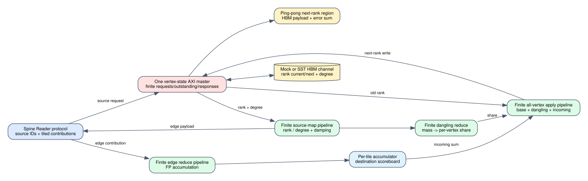

# Timed Full PageRank compute path

Date: 2026-07-25
Branch: `codex/fine-grained-cycle-sim`
Baseline commit: `ccf9393`

## Scope

This milestone adds the first execution-driven Full PageRank compute path. It
consumes the same `PartConvWord` and returns the same `SourceValueWord` protocol
used by the Spine Reader, but does not yet package Reader and compute into one
public vertical-slice system.



The implementation deliberately does not use a Python adjacency or a C++ rank
array as the timing source. Rank and degree source operands are read through a
`FixedAxiPort`; apply reads old rank and writes the next rank to the HBM
ping-pong region. The rank mirror is only an observable functional result and
is checked against the bytes written to HBM.

## Per-iteration execution

1. Full PageRank requires one source request for every vertex, including
   vertices with no outgoing edges.
2. Each request reads current rank and out-degree from distinct aligned regions
   behind the same vertex-state AXI master.
3. The finite source-map pipeline computes `damping * rank / degree`; dangling
   ranks enter the finite reduce pipeline.
4. Reader-provided edge contributions enter the finite reduce pipeline. A
   destination scoreboard prevents two unresolved reductions from reading the
   same stale tile accumulator.
5. At tile end, apply reads every old rank in the tile, executes the finite
   apply pipeline, and writes every new rank into the ping-pong region.
6. Tiles with no incoming edges are still synthesized at `DoneAll`, so every
   vertex receives base and dangling contributions.
7. FIFO capacity, AXI request windows, HBM latency/contention, operation
   latency/II/capacity, response backpressure, and Reader stream backpressure
   all remain explicit.

Full PageRank rejects a source protocol that does not refresh exactly `N`
vertices, duplicate destination tiles, malformed tile edges, and Reader
overflow. These conditions cannot silently produce a partial PageRank result.

## Deterministic evidence

The four-vertex graph is:

```text
0 -> 1, 0 -> 2, 1 -> 2, 3 -> 2
out-degree = [2, 1, 0, 1]
damping = 0.8
initial rank = 0.25 each
```

Vertex 2 is dangling. One iteration must produce:

```text
dangling mass/share: 0.25 / 0.05
new rank:             [0.1, 0.2, 0.6, 0.1]
rank sum:             1.0
```

Observed timing and traffic with the regression profile:

```text
cycles:                    156
HBM requests:              16
primary rank read bytes:   32
degree read bytes:         16
primary rank write bytes:  16
source-map operations:      4
reduce operations:          8
apply operations:           4
```

The 16 memory requests are eight source reads (`rank + degree`), four apply
reads, and four apply writes. The four HBM output words exactly match the rank
mirror and the analytical result.

The test uses a 4-cycle Mock HBM latency and provisional operation latencies
`source/reduce/apply = 3/2/3` cycles. Therefore 156 cycles proves execution and
accounting, not calibrated PageRank performance. All profile values remain
configurable, and the same AXI port can use the SST backend.

Machine-readable evidence is
`docs/evidence/spine_timed_full_pagerank_compute_20260725.json`.

## Reproduction

```bash
cd /home/chuxiao/spine-cycle-sim
cmake --build build/cycle-core -j2
./build/cycle-core/cpp/spine_cycle_core_tests spine_timed_pagerank_compute
./build/cycle-core/cpp/spine_cycle_core_tests
python3 -m unittest discover -s tests
make -C cpp/sst -B -j2
git diff --check
```

## Remaining boundary

1. Package this compute with real Spine maintenance and Reader so graph edge
   payloads come from the level hierarchy rather than a test stream producer.
2. Add iteration reset and rank-buffer swap, then validate convergence against
   an independent CPU oracle on real graph files.
3. Model or characterize tile-accumulator URAM read/write latency and the exact
   HLS floating-point pipeline latency/II.
4. Extend the controller to thresholded residual PageRank and its residual
   state read/clear/write protocol.
5. Run the same vertical slice with SST-HBM and capture contention evidence.
