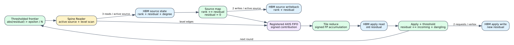

# Timed Spine thresholded residual PageRank

Date: 2026-07-25
Branch: `codex/fine-grained-cycle-sim`

## Scope

The shared timed PageRank controller now executes either Full PageRank or
thresholded residual PageRank through the same Spine maintenance, Reader,
registered AXIS, finite algorithm pipeline, AXI, and HBM interfaces.



This is not a second hand-written graph engine. `GraphAlgorithmPolicy` selects
the source, reduce, and apply behavior while the surrounding memory and stream
controller remains shared.

## Residual round

For every active source, the compute controller:

1. reads rank, signed residual, and out-degree from the vertex-state HBM port;
2. executes source-map, adding residual to rank and clearing residual;
3. writes the changed rank and residual words back to HBM;
4. returns `damping * residual / out_degree` to Reader; and
5. contributes an active dangling residual to the global dangling reduction.

Reader scans only the level ranges belonging to active edge-bearing sources.
Edgeless active sources still participate in source-map and dangling reduction
through the explicit source-refresh protocol.

After signed contributions are reduced by destination tile, all vertices read
their old residual from HBM, add incoming and dangling residual, write the new
residual to HBM, and join the next frontier only when
`abs(residual) > epsilon / N`.

The per-round vertex-state request ledger is therefore:

```text
active source: rank read + residual read + degree read
             + rank write + residual-clear write       = 5 requests
all vertices: residual apply read + residual write     = 2 requests
total: 5 * active_sources + 2 * vertices
```

The C++ acceptance test checks this equation on every round.

## Evidence

The four-vertex fixture uses damping `0.8` and epsilon `1e-5`:

```text
rounds:                         49
cycles:                    266,871
final active vertices:           0
maximum per-round oracle error:  2.98023e-8
final residual L1:               5.54604e-6
final rank sum:                  0.999972
maintenance runs:               1
```

Every rank, residual, and active-frontier element is compared after every
round with an independent float32 recurrence. The final rank sum is not exactly
one because thresholded propagation intentionally stops with residual still
below `epsilon / N`; the test separately verifies residual L1 is at most
epsilon and applies the corresponding `epsilon / (1 - damping)` rank bound.

Machine-readable evidence is
`docs/evidence/spine_timed_residual_pagerank_20260725.json`.

## Reproduction

```bash
cd /home/chuxiao/spine-cycle-sim
cmake --build build/cycle-core -j2
./build/cycle-core/cpp/spine_cycle_core_tests spine_residual_pagerank
ctest --test-dir build/cycle-core --output-on-failure
python3 -m unittest discover -s tests
make -C cpp/sst -B -j2
git diff --check
```

## Claim boundary

This milestone proves cold-start residual PageRank semantics and execution-
driven Mock-HBM traffic. It does not yet prove online SST-HBM execution, real-
dataset convergence, or dynamic signed-residual initialization after an edge
batch. The source/reduce/apply floating-point latency and II remain provisional
until characterized from a matching HLS implementation.
