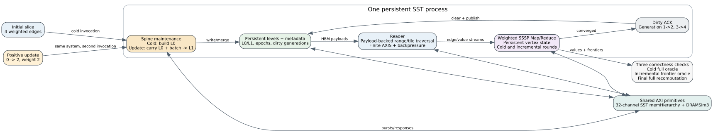

# Persistent dynamic SSSP on SST HBM

Date: 2026-07-25  
Branch: `codex/fine-grained-cycle-sim`  
Claim tier: `structural_execution_driven`  
Memory backend: SST memHierarchy + DRAMSim3, 32 HBM channels

## Scope

This milestone runs a cold weighted-SSSP invocation and a positive
differential update in one SST process. The second invocation reuses the same
Spine graph hierarchy, vertex-state array, AXI masters, finite FIFOs, HBM
backend, and dirty metadata. It does not reconstruct a simulator between
batches.



The cold batch builds L0 and converges from source 0. The update adds a lower
weight `0 -> 2` edge. Maintenance then selects L1, reads the existing L0
payload, merges the new sorted edge, retires L0, publishes L1, and advances the
dirty generation. Reader and Compute begin from the device-generated dirty
source rather than a Python-provided frontier.

## Correctness oracles

The test separates three checks that must not be conflated:

1. cold execution is compared with a full CPU synchronous-relaxation oracle;
2. update frontier evolution is compared with an incremental oracle initialized
   from the cold distances and the update source;
3. final update distances are also compared with an independent full
   recomputation on the combined graph.

For this workload the cold result is `[0, 5, 10, 11]`. The differential
frontier sequence is `0 -> 2 -> 3 -> empty`, and the final result is
`[0, 5, 2, 3]`. All value and frontier mismatch counters are zero.

This distinction matters: a full recomputation starts from infinity and has a
different intermediate frontier (`0 -> {1,2} -> 3 -> empty`). Requiring those
frontiers to match would reject a correct incremental execution.

## Evidence

Machine-readable evidence is
`docs/evidence/sst_spine_dynamic_sssp_20260725_summary.json`.

| metric | cold | positive update |
| --- | ---: | ---: |
| cycles | 25,649 | 19,671 |
| SSSP rounds | 4 | 3 |
| maintenance cycles | 2,211 | 2,716 |
| maintenance target | L0 | L1 |
| backend requests | 2,982 | 2,509 |

Whole-process memory closure:

| metric | value |
| --- | ---: |
| total core cycles | 45,320 |
| backend requests | 5,491 |
| DRAM reads + writes | 3,740 + 1,751 = 5,491 |
| DRAM activates | 292 |
| DRAM row hits | 3,417 read + 1,623 write |

The update reports 19 sorted-edge scan visits but 320 sorted bytes. This is an
intentional ledger decomposition, not a fitted constant:

```text
19 scan visits * 16 B + 1 carry new-batch read * 16 B = 320 B
```

The carry read is required when the update is merged with the persisted L0
payload into L1. Both terms are exported separately and checked by the Python
acceptance validator.

## Reproduction

```bash
cd /home/chuxiao/spine-cycle-sim
make -C cpp/sst -j2
python3 scripts/run_sst_spine_vertical.py \
  --scenario dynamic_sssp \
  --out-dir results/sst_spine_dynamic_sssp_20260725
```

Expected final output:

```text
PASS spine_vertical: cycles=45320 backend_requests=5491 DRAM=5491 ACT=292 row_hits=5040
```

Run regression tests with:

```bash
cmake --build build/cycle-core -j2
ctest --test-dir build/cycle-core --output-on-failure
python3 -m unittest discover -s tests
git diff --check
```

## Claim boundary

This proves persistent positive-differential weighted SSSP on the shared
fine-grained core and online SST/DRAMSim3 backend. The timing is structural and
execution-driven; it is not yet hardware-cycle calibrated. The current path
does not support edge deletion or weight increase. Those non-monotonic updates
must enter an explicit timed graph-rebuild and SSSP full-recompute path because
the minimum-weight compacted hierarchy cannot reconstruct a superseded larger
weight from its current payload alone.
