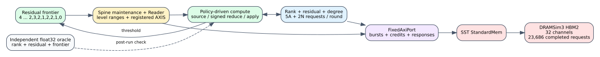

# SST-HBM Spine thresholded residual PageRank

Date: 2026-07-25
Branch: `codex/fine-grained-cycle-sim`

## Scope

Thresholded residual PageRank now runs to convergence through the complete
execution-driven Spine and online SST/DRAMSim3 path.



The simulator, rather than the oracle, decides each next frontier. The oracle
independently computes float32 rank, residual, and threshold decisions and is
consulted only when writing the final evidence.

## Result

For the four-vertex insertion graph, damping `0.8`, and epsilon `1e-5`:

```text
rounds to empty frontier:          49
total core cycles:            261,084
backend requests:              23,686
DRAMSim3 reads + writes:       21,961 + 1,725 = 23,686
maximum rank/residual error:        0
final residual L1:             5.54604e-6
final rank sum:                0.999972
```

All 49 per-round memory ledgers satisfy:

```text
compute requests = 5 * active_sources + 2 * vertices
```

The first 42 rounds keep all four vertices active and issue 28 compute-state
requests each. The final frontier sequence is
`2, 3, 2, 1, 2, 2, 1 -> 0`, with request counts
`18, 23, 18, 13, 18, 18, 13`. The frontier is not required to shrink
monotonically: a residual pushed by one active vertex can reactivate another.

The final seven rounds take `5,122, 5,205, 5,082, 5,024, 5,145, 5,083, 4,981`
cycles. Their modest improvement over full-frontier rounds shows that the
current residual implementation still performs an all-vertex apply pass. On
this tiny graph, Reader/controller fixed work also dominates, so this is an
architectural observation rather than a large-graph speedup claim.

DRAMSim3 reports `3.822733692e9 pJ`. This is explicitly memory-only energy and
includes background energy across the configured 32 channels; it is not total
accelerator energy.

Machine-readable evidence is
`docs/evidence/sst_spine_residual_pagerank_20260725_summary.json`.

## Reproduction

```bash
cd /home/chuxiao/spine-cycle-sim
make -C cpp/sst -B -j2
python3 scripts/run_sst_spine_vertical.py \
  --scenario residual_pagerank \
  --out-dir results/sst_spine_residual_pagerank_repro \
  --no-build
python3 -m unittest discover -s tests
ctest --test-dir build/cycle-core --output-on-failure
git diff --check
```

The runner records and validates every frontier size, iteration duration, and
compute request count. Damping, epsilon, maximum rounds, memory credits, and
source/edge/reduce/apply pipeline latency, II, and capacity remain configurable.

## Remaining boundary

This closes cold-start residual PageRank on both Mock-HBM and SST-HBM. Dynamic
edge batches still need a timed initializer for
`updated_target - previous_rank`; the Python functional layer already defines
and dual-oracle validates that signed initialization. Real-dataset convergence
and HLS characterization of floating-point pipeline timing also remain.
